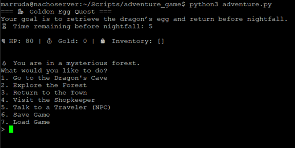

<<<<<<< HEAD
# adventure_game
A terminal-based Python text adventure game where you must retrieve a golden egg from a dragon’s cave and return to town before nightfall—all while managing health, inventory, and time.
=======
# 🐉 Adventure Game: The Golden Egg Quest

A terminal-based Python text adventure game where you must retrieve a golden egg from a dragon’s cave and return to town before nightfall—all while managing health, inventory, and time.



---

## 🎮 Features

- ✅ Inventory tracking (Sword, Healing Potions, Golden Egg, etc.)
- 🐉 Stealth encounter with a sleeping dragon
- 🕒 Time-based danger (wolves appear at night)
- 🛒 Shopkeeper and item purchases
- 🗣️ Random NPC interactions (blessings, riddles, gold gifts)
- ⚔️ Turn-based combat system (goblins, wolves)
- 💾 Save and load game state

---

## 🚀 How to Run

### Prerequisites
- Python 3.8+
- Git (to clone the repo)
- User with sudo privileges 

### Run the Game
```bash
git clone https://github.com/yourusername/adventure_game.git
cd adventure_game
sudo chmod +x adventure.py
python3 adventure.py
```
---

## 🧠 Lessons Learned
	•	How to structure modular Python adventure games
	•	Implemented simple turn-based combat and risk-based decisions
	•	Used pickle to persist save/load game state
	•	Developed a dynamic text interface with branching paths and NPCs

---

## 🗂 Directory Structure

adventure_game/
├── adventure.py        # Main game script
├── README.md
├── images/
    └── adventure_game_demo.png  # Example screenshot


---

## 🛠️ Contributions

PRs welcome! If you find bugs or want to add new encounters, feel free to open an issue or submit a pull request.

---

## 📄 License

MIT License
